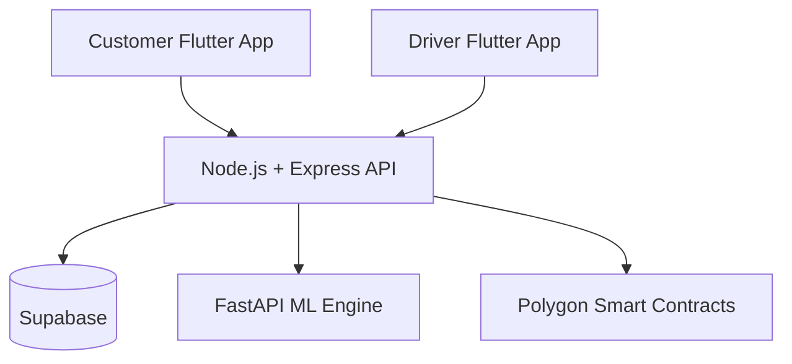

# 🚛 Truxify

### Broker-Free · ML-Powered · Blockchain-Secured Freight Platform

**Directly connecting manufacturers and truck drivers — eliminating the middleman, maximising earnings, and bringing transparency to India's ₹14 lakh crore freight industry.**

[](https://flutter.dev)
[](https://nodejs.org)
[](https://fastapi.tiangolo.com)
[](https://polygon.technology)
[](LICENSE)
[](CONTRIBUTING.md)

[Overview](#-overview) · [Problem](#-the-problem) · [Solution](#-the-solution) · [Architecture](#-architecture) · [ML Layer](#-ml-layer) · [Blockchain](#-blockchain-layer) · [Getting Started](#-getting-started) · [Roadmap](#-roadmap)

---

## 📌 Overview
Truxify is an open-source, broker-free freight marketplace that connects manufacturers directly to truck drivers across India's national highway network.

India has 1.4 crore registered trucks. Most drive back empty after every delivery. Most drivers earn subsistence wages after brokers take 30–40% of every booking. Most small manufacturers still find trucks through a chain of phone calls that takes 6+ hours.

Truxify fixes all three problems simultaneously — with a platform that is open source, self-hostable, and built for the people every existing solution has ignored.

## 🏗️ Architecture Preview



For the complete system architecture, data flows, infrastructure layers, and service responsibilities, see:

👉 [docs/architecture.md](docs/architecture.md)
## 🔴 The Problem
```text
Manufacturer -> Broker -> Sub-Broker -> Truck Owner -> Driver
     ✅              💸         💸            💸          😔
```
By the time money reaches the driver, 30–40% is already gone.

| Pain Point | Who Suffers | Scale |
|---|---|---|
| 30–40% broker commission on every trip | Truck drivers | 1.4 crore trucks |
| 6+ hours to find a truck via phone chains | Manufacturers | Millions of SMEs |
| Drivers return empty after every delivery | Drivers + environment | ₹30,000+ lost per empty trip |
| Zero live tracking once truck is moving | Manufacturers | Every single shipment |
| Payment delayed 30–60 days | Drivers | Destroys cash flow |
| Fake documents, fraud, no accountability | Both sides | Industry-wide |

BlackBuck, Vahak, Rivigo digitised the broker without eliminating them. They serve large fleet operators and MNCs. The single truck owner driving 2 trips a week has nobody. Truxify is built for that driver.

## ✅ The Solution
```text
Manufacturer ──────────────────────────── Driver
                    TRUXIFY
         ML Matching · Blockchain Escrow
         Voice AI · Live Tracking · n8n
```
| Feature | BlackBuck / Vahak | Truxify |
|---|---|---|
| Open Source | ❌ Proprietary | ✅ Fully open, self-hostable |
| Target user | Large fleets, MNCs | Single truck owners, small manufacturers |
| ML matching | Basic | 10-model bilateral matching + VRP |
| Blockchain | None | Escrow + docs + receipts + reputation |
| Deadhead elimination | Not active | Pre-trip + live mid-trip reoptimisation |
| Voice AI | None | Whisper + LLM + ElevenLabs |
| Payment | 30-day delay | Instant UPI escrow on delivery |
| Commission | Platform takes cut | Transparent, minimal, driver-first |

## 🏗️ Architecture
Truxify is built in 6 distinct layers, each solving a specific trust or efficiency problem:

```text
┌─────────────────────────────────────────────────────────┐
│                    FLUTTER APPS                          │
│         Customer App          Driver App                 │
└──────────────────┬──────────────────────────────────────┘
                   │ REST + WebSockets
┌──────────────────▼──────────────────────────────────────┐
│              NODE.JS + EXPRESS (Main API)                │
│     Auth · Bookings · Payments · WebSocket Server        │
└────┬──────────────┬──────────────────────┬──────────────┘
     │              │                      │
┌────▼────┐  ┌──────▼──────┐  ┌───────────▼────────────┐
│ FASTAPI │  │  SUPABASE   │  │  POLYGON SMART CONTRACT │
│   ML    │  │  PostgreSQL │  │  Escrow · Docs · Repute │
│ Models  │  │  + PostGIS  │  └────────────────────────┘
└────┬────┘  └──────┬──────┘
     │              │
┌────▼────┐  ┌──────▼──────┐
│  OSRM   │  │  MONGODB    │
│ Routing │  │  GPS Logs   │
└─────────┘  └─────────────┘
```

| Layer | Technology | Purpose |
|---|---|---|
| Customer App | Flutter | Place orders, live tracking, voice AI, milestone tracker |
| Driver App | Flutter | Find loads, active trip, en-route load suggestions |
| Main API | Node.js + Express | REST API, WebSocket live tracking, orchestration |
| ML Engine | FastAPI + Python | 10 models — matching, prediction, optimisation |
| Blockchain | Polygon + Solidity | Trustless escrow, document integrity, reputation |
| Automation | n8n (self-hosted) | Dispute pipeline, ML retraining trigger |
| Voice AI | WebRTC + Whisper + LLM + ElevenLabs | Customer shipment query assistant |
| Live Tracking | OSM + Leaflet + WebSockets | Real-time truck map inside customer app |
| Route Display | Google Maps deep link | Driver multi-stop navigation, zero API cost |

## 🧠 ML Layer
10 connected models running on FastAPI:

| # | Model | Type | Purpose |
|---|---|---|---|
| 1 | Two-Sided Bilateral Matcher | Optimisation | Pairs loads + trucks so both sides maximise gain |
| 2 | Driver Profit Predictor | Regression | Net earnings after fuel, toll, time — shown before accept |
| 3 | 3D Bin Packer + VRP | Combinatorial | Packs multi-customer loads, sequences stops |
| 4 | Behavioural Collaborative Filter | Collab Filtering | Personalises truck recommendations from past behaviour |
| 5 | Dynamic Price Forecaster | Time-Series | Fair price ranges per route using seasonal + fuel trends |
| 6 | ETA Predictor | Regression | Accurate delivery time from traffic, route type, speed history |
| 7 | Trust & Risk Scorer | Classification | Classifies drivers/customers from behavioural patterns |
| 8 | Deadhead Eliminator | Matching | Scans return loads before driver finishes current trip |
| 9 | Demand Heatmap | Forecasting | Live + 48hr forecast of high-demand zones |
| 10 | Live Mid-Trip Reoptimiser | Real-Time ML | When space opens mid-trip, instantly rescans for new loads |

Retraining: Weekly batch via n8n trigger → validated against accuracy benchmark → auto-rollback if worse.
Cold start: Synthetic realistic booking data. Inference: Milliseconds (models loaded in memory).

## ⛓️ Blockchain Layer
Built on Polygon (near-zero gas fees) with Solidity smart contracts:

💸 Trustless Payment Escrow — Payment locked on booking → GPS geofence + OTP confirms delivery → contract auto-releases to driver. Nobody (not even Truxify) can touch escrowed funds.

📄 Document Hash Integrity — RC book, licence, insurance hashed on-chain at upload. Any tampering = hash mismatch = instant detection.

🧾 On-Chain Delivery Receipts — Every completed trip recorded immutably: origin, destination, goods, price, driver, timestamp. Legally admissible, useful for GST filings.

⭐ Decentralised Driver Reputation — Ratings written on-chain after every delivery. Cannot be deleted by anyone. Driver owns their reputation permanently and it's portable across any platform.

## ⚙️ Automation Layer
Two critical n8n workflows:

Dispute Resolution — Unconfirmed delivery triggers auto-flag → smart contract payment frozen → GPS trail + OTP logs packaged as evidence → both parties notified → unresolved in 24h escalates to arbitration → resolution releases funds accordingly.

ML Retraining — Weekly data volume check → threshold met triggers Python training pipeline → new model accuracy validated → better model deployed, worse auto-rolled back → team notified with performance report.

## 🎙️ Voice AI
Customer speaks naturally — no app navigation needed:

| Query | Response |
|---|---|
| "Where is my package?" | Fetches live GPS → speaks current location + road name |
| "When will it reach?" | Pulls ETA predictor → speaks estimated arrival |
| "Is my payment released?" | Checks smart contract state → confirms or explains hold |

Stack: WebRTC (free, no Twilio) → Whisper → LLM → ElevenLabs

## 🔄 Cancellation & Mid-Trip Changes
One of Truxify's most powerful features — touching all 6 layers simultaneously:

| Scenario | Outcome |
|---|---|
| Cancel before driver starts | Full refund, smart contract releases back |
| Cancel after driver en route | ML calculates distance covered → proportional penalty |
| Change drop location | New route + cost → blockchain adjusts → auto call to driver |
| Drop change frees space | ML instantly finds new loads to fill truck |
| Driver cancels | Trust score penalised → ML finds replacement instantly |

## 📱 App Screens
### Customer App
| Screen | Purpose |
|---|---|
| Home | Active shipments, quick stats, recent routes, book CTA |
| Find Trucks | ML-powered search with dimensions, goods type, price estimate |
| Truck Results | Matched trucks ranked by ML — price, ETA, rating, space |
| Orders | Active orders with milestone tracker, history |
| Live Tracking | OSM map, moving truck marker, Voice AI, call driver |
| Order Detail | Timeline, price breakdown, blockchain receipt, rebook |
| Profile | Stats, payment, documents, language, settings |

### Driver App
| Screen | Purpose |
|---|---|
| Home | Current trip status, today's earnings, demand heatmap |
| Active Trip | Route, stops, delivery OTPs, open Google Maps |
| Available Loads | Browse loads matching route, profit shown upfront |
| En-Route Loads | ML suggestions for loads pickable along current route |
| Past Trips | History, earnings breakdown, on-chain reputation |
| Profile | Truck details, documents, availability toggle |

## 🛠️ Tech Stack
| Layer | Technology |
|---|---|
| Mobile Apps | Flutter |
| Auth + Push | Firebase Auth + FCM |
| Main API | Node.js + Express |
| ML Inference | FastAPI + scikit-learn + PyTorch |
| Primary DB | PostgreSQL + PostGIS (Supabase) |
| GPS + Event Logs | MongoDB Atlas |
| Cache | Upstash Redis |
| Blockchain | Polygon + Solidity |
| Automation | n8n (self-hosted) |
| Voice AI | WebRTC + Whisper + LLM + ElevenLabs |
| Live Map | OSM + Leaflet.js |
| Route Engine | OSRM + OpenStreetMap |
| Document Verification | Digilocker API |
| Storage / CDN | Cloudflare R2 + CDN |
| Monitoring | Sentry |
| Hosting | Render + UptimeRobot |
| CI/CD | GitHub Actions |

## 🗺️ Map Strategy
| Feature | Solution | Cost |
|---|---|---|
| Customer live tracking | OSM + Leaflet inside app (WebSockets) | Free |
| Driver navigation | Google Maps deep link (pre-planned by ML) | Free |
| ML route calculation | OSRM + OpenStreetMap (self-hosted) | Free |

## 🚀 Getting Started
Note: Truxify is in active development (Phase 2). The core platform features are the current focus.

### Prerequisites
- Flutter SDK 3.x
- Git

### Run the Customer App
```bash
git clone https://github.com/KanishJebaMathewM/Truxify.git
cd Truxify
flutter pub get
flutter run
```

### Run the Backend With Docker
```bash
cp .env.example .env
docker compose up --build
```
The Compose stack overrides the cloud MongoDB and Redis placeholders from `.env` inside the API container:

```env
MONGODB_URI=mongodb://mongo:27017
MONGODB_DB_NAME=truxify_telemetry
REDIS_URL=redis://redis:6379
```
This lets the backend use the local mongo and redis services without editing `.env` away from production-style values.

## 🧩 Backend Development Setup
The backend lives in `backend/api`. Use the following steps to set it up locally:

```bash
cd backend/api
npm install
cp .env.example .env
npm run dev
```

### Available Commands
- `npm run dev` starts the backend in development mode with auto-reload.
- `npm start` starts the production server.
- `npm test` runs the backend test suite.

## 🔧 Environment Configuration
The backend uses `backend/api/.env.example` as the template for local configuration. Copy it to `.env` before running the service and fill in the required values for your environment.

This project may require configuration for Supabase, PostgreSQL, MongoDB, Redis, Firebase, Polygon, and routing services. Keep sensitive values such as API keys, private keys, and service account JSON out of version control.

Do not commit secrets to the repository. Treat `.env` as a local-only file and update `.env.example` when new configuration values are needed for onboarding.

## 🐳 Docker Compose Setup
Run the full local stack with:

```bash
docker compose up --build
```
This starts the following services:

| Service | Description |
|---|---|
| api | Backend API running from backend/api on port 5000 |
| db | PostgreSQL/PostGIS database on port 5432 |
| mongo | MongoDB event/log storage on port 27017 |
| redis | Redis cache on port 6379 |

The api container is configured to use the local db, mongo, and redis services so you can work with a complete development environment without connecting to external infrastructure.

## 🌐 Local Service Access
Once the stack is running, you can reach the local services here:

- API: http://localhost:5000
- PostgreSQL: localhost:5432
- MongoDB: localhost:27017
- Redis: localhost:6379

## 🤝 Contributor Notes
- Verify that `backend/api/.env` exists before starting the backend or Docker Compose services.
- Run `npm test` before opening a pull request to catch regressions early.
- Prefer Docker Compose when you want the full local development environment with API, PostgreSQL/PostGIS, MongoDB, and Redis together.

## 📊 Impact Metrics (Projected)
| Metric | With Brokers | With Truxify |
|---|---|---|
| Driver earnings | 60–70% of freight value | 90–95% of freight value |
| Time to find truck | 4–6 hours | Under 2 minutes |
| Empty return trips | ~40% of all trips | Near zero |
| Payment delay | 30–60 days | Instant on delivery |
| Document fraud | Rampant | Blockchain-verified |
| Supply chain visibility | Zero | Full real-time tracking |

## 🗺️ Roadmap
### Phase 1 — Foundation
- [x] Customer app frontend (Flutter)
- [x] Driver app frontend (Flutter)
- [x] Backend API skeleton (Node.js)
- [x] Database schema design

### Phase 2 — Core Platform (Current)
- [ ] User authentication (Firebase)
- [ ] Load posting and bidding
- [ ] Basic ML matching
- [ ] Live tracking (WebSockets + OSM)

### Phase 3 — Intelligence
- [ ] Full 10-model ML pipeline
- [ ] FastAPI inference service
- [ ] Dynamic pricing
- [ ] Deadhead elimination

### Phase 4 — Trust Layer
- [ ] Polygon smart contracts
- [ ] UPI escrow integration
- [ ] Digilocker document verification
- [ ] On-chain reputation

### Phase 5 — Automation + Voice
- [ ] n8n dispute pipeline
- [ ] ML retraining trigger
- [ ] Voice AI integration
- [ ] Multi-language support (English, Hindi, Tamil)

### Phase 6 — Production
- [ ] Security audit
- [ ] Load testing
- [ ] Open source deployment guide
- [ ] State government partnership pilot

## 🤝 Contributing
Truxify welcomes contributors of all skill levels. See CONTRIBUTING.md for guidelines.

```bash
# Fork → Clone → Branch → Commit → PR
git checkout -b feature/your-feature-name
git commit -m "feat: add profit predictor model"
git push origin feature/your-feature-name
```

## 👥 Contributors
Thanks to all contributors ❤️

[](https://github.com/KanishJebaMathewM/Truxify/graphs/contributors)

## 📄 License
[MIT License](LICENSE) — Truxify is intentionally open source so any state transport department, NGO, or logistics cooperative can self-host it for free.

---

<div align="center">

**Built with ❤️ for India's 1.4 crore truck drivers**

⭐ Star this repo if you believe freight should be fair

[Report Bug](https://github.com/KanishJebaMathewM/Truxify/issues) · [Request Feature](https://github.com/KanishJebaMathewM/Truxify/issues)

</div>

