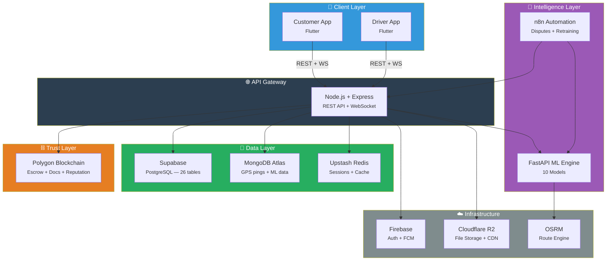
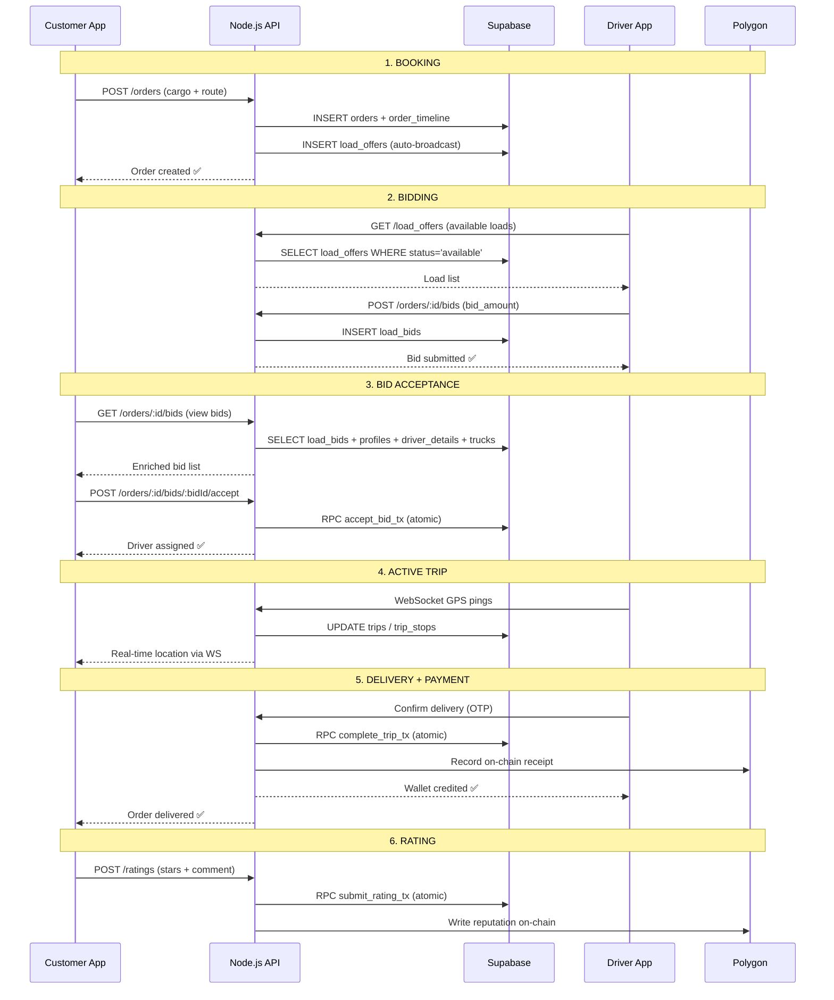
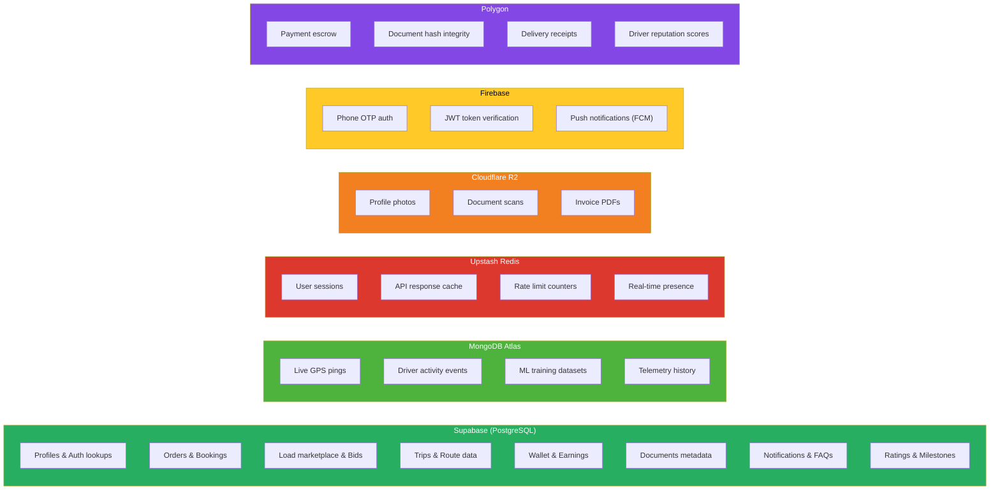
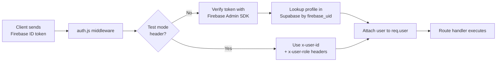
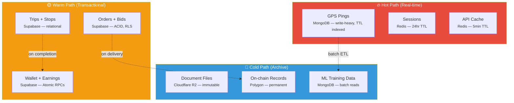
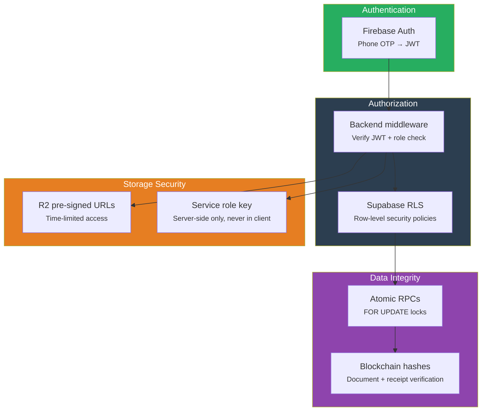

# 🏗️ Truxify — System Architecture

> Broker-free freight platform connecting manufacturers directly to truck drivers across India.

---

## High-Level Architecture



---

## Data Flow — Order Lifecycle



Wallet history and earnings views now also surface escrow payout transaction hashes when a release is completed on-chain. Example wallet history payload fields:

```json
{
  "tx_hash": "0xabc123...",
  "trip_display_id": "TRIP-2026-0001"
}
```

---

## Service Responsibilities

### Where Each Service Lives



---

## Backend API Routes

### Implemented Endpoints

| Method | Endpoint | Auth | Role | Description |
|--------|----------|------|------|-------------|
| `POST` | `/api/orders` | ✅ | customer | Create a new order + auto-broadcast load offer |
| `GET` | `/api/orders/history` | ✅ | customer | Fetch customer's order history |
| `GET` | `/api/orders/:id` | ✅ | any | Fetch order detail + timeline + driver info |
| `POST` | `/api/orders/:id/bids` | ✅ | driver | Submit bid on a load offer |
| `GET` | `/api/orders/:id/bids` | ✅ | customer | View all bids with enriched driver profiles |
| `POST` | `/api/orders/:id/bids/:bidId/accept` | ✅ | customer | Accept bid (calls `accept_bid_tx` RPC) |
| `GET` | `/api/drivers/stats` | ✅ | driver | Fetch driver stats + truck details |
| `PUT` | `/api/drivers/online` | ✅ | driver | Toggle online/offline status |
| `GET` | `/api/drivers/wallet/history` | ✅ | driver | Fetch wallet transaction history |
| `GET` | `/api/drivers/earnings/summary` | ✅ | driver | Fetch daily earnings chart data |
| `POST` | `/api/drivers/wallet/withdraw` | ✅ | driver | Withdraw funds (calls `withdraw_funds_tx` RPC) |

### Auth Flow



---

## Technology Stack

### Production Stack

| Layer | Service | Purpose | Pricing |
|-------|---------|---------|---------|
| **Mobile** | Flutter 3.x | Customer + Driver apps | Free |
| **Auth** | Firebase Auth | Phone OTP + JWT tokens | Free tier |
| **Push** | Firebase FCM | Push notifications | Free |
| **API** | Node.js + Express | REST + WebSocket server | Render free tier |
| **ML** | FastAPI + Python | 10 ML models | Render free tier |
| **Primary DB** | Supabase (PostgreSQL) | 26 tables, RPC functions | Free tier (500MB) |
| **GPS/Events** | MongoDB Atlas | Live pings, telemetry | Free tier (512MB) |
| **Cache** | Upstash Redis | Sessions, rate limits | Free tier (10K/day) |
| **Storage** | Cloudflare R2 | Documents, photos | Free tier (10GB) |
| **Blockchain** | Polygon | Escrow, receipts, reputation | ~$0.001/tx |
| **Routing** | OSRM (self-hosted) | Distance + duration calc | Free (OSM data) |
| **Maps** | OSM + Leaflet | Customer live tracking | Free |
| **Navigation** | Google Maps deep link | Driver turn-by-turn | Free |
| **Automation** | n8n (self-hosted) | Disputes + ML retraining | Free |
| **Monitoring** | Sentry | Error tracking | Free tier |
| **CI/CD** | GitHub Actions | Build + test | Free |

### Why These Choices?

> [!NOTE]
> Every service was chosen to run on **free tiers** during development and early production. Truxify is designed so a state transport department or NGO can self-host the entire platform at near-zero cost.

---

## Directory Structure

```
Truxify/
├── apps/
│   ├── customer/          # Flutter customer app
│   │   └── lib/
│   │       ├── screens/   # UI screens
│   │       ├── widgets/   # Reusable components
│   │       ├── data/      # Mock data (until Supabase integration)
│   │       └── theme/     # Design system
│   └── driver/            # Flutter driver app
│       └── lib/
│           ├── screens/
│           ├── widgets/
│           ├── data/
│           └── theme/
├── backend/
│   └── api/               # Node.js + Express API
│       └── src/
│           ├── config/    # db.js (Supabase + MongoDB + Redis init)
│           ├── middleware/ # auth.js (Firebase + Supabase verify)
│           ├── routes/    # orderRoutes.js, driverRoutes.js
│           └── sockets/   # WebSocket GPS tracking
├── blockchain/            # Polygon smart contracts (Solidity)
├── automation/            # n8n workflow definitions
├── docs/
│   ├── architecture.md    # ← You are here
│   ├── schema.md          # Database schema visualization
│   ├── supabase_setup.sql # One-shot DB setup for contributors
│   ├── supabase_drop_all.sql
│   ├── supabase_schema.sql
│   ├── supabase_queries.sql
│   └── migrations/
│       ├── 01_rpc_transactions.sql
│       └── 02_patch_missing.sql
├── .env.example           # All service credentials template
├── docker-compose.yml
└── README.md
```

---

## Data Partitioning Strategy



---

## Environment Variables

All services are configured via a single `.env` file at the project root. See [`.env.example`](../.env.example) for the full template.

| Group | Variables | Used By |
|-------|----------|---------|
| **Supabase** | `SUPABASE_URL`, `SUPABASE_ANON_KEY`, `SUPABASE_SERVICE_ROLE_KEY`, `DATABASE_URL` | Backend API |
| **MongoDB** | `MONGODB_URI`, `MONGODB_DB_NAME` | Backend API, ML Engine |
| **Redis** | `REDIS_URL`, `REDIS_REST_URL`, `REDIS_REST_TOKEN` | Backend API |
| **Firebase** | `FIREBASE_PROJECT_ID`, `FIREBASE_SERVICE_ACCOUNT_JSON`, `FIREBASE_API_KEY` | Backend API, Flutter apps |
| **Cloudflare R2** | `R2_ACCOUNT_ID`, `R2_ACCESS_KEY_ID`, `R2_SECRET_ACCESS_KEY`, `R2_BUCKET_NAME` | Backend API |
| **Polygon** | `POLYGON_RPC_URL`, `REPUTATION_CONTRACT_ADDRESS`, `RELAYER_WALLET_PRIVATE_KEY` | Backend API |
| **Routing** | `ROUTING_API_KEY` | ML Engine |

---

## Security Model



> [!IMPORTANT]
> The `SUPABASE_SERVICE_ROLE_KEY` bypasses RLS and must **never** be exposed to client apps. It's used only in the Node.js backend. Flutter apps authenticate via Firebase and call the backend API — they never talk to Supabase directly.

---

## Current Status

| Component | Status | Notes |
|-----------|--------|-------|
| Customer App (Flutter) | ✅ Frontend complete | Mock data, no Supabase SDK yet |
| Driver App (Flutter) | ✅ Frontend complete | Mock data, no Supabase SDK yet |
| Backend API (Node.js) | ✅ Core routes live | Orders, bids, wallet, driver stats |
| Database (Supabase) | ✅ 26 tables + 4 RPCs | Schema finalized, seed data included |
| Auth (Firebase) | 🔧 Integrated in backend | Middleware working, test mode available |
| GPS Tracking (MongoDB) | 🔧 WebSocket handler built | `tracker.js` handles live pings |
| ML Engine (FastAPI) | 📋 Planned | Skeleton exists in `backend/ml/` |
| Blockchain (Polygon) | 📋 Planned | Contract directory exists |
| Automation (n8n) | 📋 Planned | Workflow definitions pending |
| Voice AI | 📋 Planned | WebRTC + Whisper + LLM stack |
