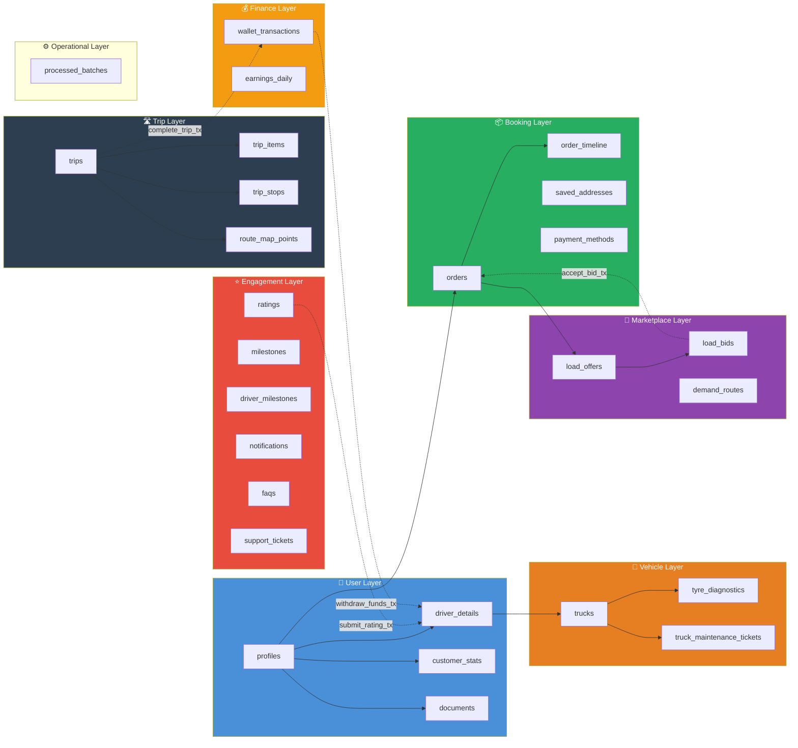
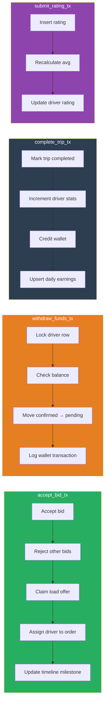

# 📊 Truxify — Database Schema

> **27 tables · 4 RPC functions · 27 foreign keys**
> Critical business entities now use physical referential integrity for core joins and audit trails.

---

## Entity Relationship Diagram

```mermaid
erDiagram
    profiles {
        uuid id PK
        text firebase_uid UK
        text role
        text full_name
        text phone
        text email
        text company_name
        text avatar_url
        text language
        boolean dark_mode
        boolean is_active
        timestamptz created_at
        timestamptz updated_at
    }

    driver_details {
        uuid id PK
        uuid user_id UK
        uuid truck_id
        numeric rating
        int total_trips
        numeric completion_rate
        boolean is_online
        int wallet_confirmed
        int wallet_pending
        int wallet_total
    }

    customer_stats {
        uuid id PK
        uuid user_id UK
        int total_orders
        int total_saved
        numeric co2_reduced_kg
    }

    trucks {
        uuid id PK
        uuid driver_id
        text name
        text number_plate
        numeric max_capacity_tons
        int fuel_level_pct
        int engine_health_pct
        boolean tpms_connected
        date insurance_expiry
        date puc_expiry
        date permit_expiry
    }

    tyre_diagnostics {
        uuid id PK
        uuid truck_id
        text position
        numeric pressure_psi
        text status
    }

    truck_maintenance_tickets {
        uuid id PK
        uuid truck_id
        uuid driver_id
        text category
        text description
        text status
    }

    documents {
        uuid id PK
        uuid user_id
        text doc_type
        text status
        text file_url
        text ipfs_hash
        text blockchain_hash
        date valid_until
    }

    saved_addresses {
        uuid id PK
        uuid user_id
        text label
        text address_line
        text city
        text pincode
        float latitude
        float longitude
        boolean is_default
    }

    payment_methods {
        uuid id PK
        uuid user_id
        text method_type
        text display_label
        text provider
        boolean is_default
    }

    orders {
        uuid id PK
        text order_display_id UK
        uuid customer_id
        uuid driver_id
        uuid truck_id
        text status
        text pickup_address
        float pickup_lat
        float pickup_lng
        text drop_address
        float drop_lat
        float drop_lng
        date pickup_date
        text goods_type
        numeric weight_tonnes
        int total_amount
        text cancellation_reason
        text driver_name
        text eta
    }

    order_timeline {
        uuid id PK
        text order_display_id
        text milestone
        timestamptz milestone_time
        boolean completed
        int sort_order
    }

    load_offers {
        uuid id PK
        text order_display_id
        uuid customer_id
        text customer_name
        text route_label
        text goods_type
        text weight
        int freight_value
        int net_profit
        text status
        boolean is_en_route
    }

    load_bids {
        uuid id PK
        uuid load_id
        uuid driver_id
        int bid_amount
        text status
    }

    trips {
        uuid id PK
        text trip_display_id UK
        uuid driver_id
        text route_label
        text status
        date trip_date
        int total_earnings
        int net_earnings
        text blockchain_hash
        boolean verified_on_chain
    }

    trip_items {
        uuid id PK
        text trip_display_id
        text customer_name
        text goods
        text destination
        int earnings
        boolean is_delivered
    }

    trip_stops {
        uuid id PK
        text trip_display_id
        text customer_name
        text drop_location
        text status_label
        boolean is_current
        boolean is_completed
    }

    route_map_points {
        uuid id PK
        text trip_display_id
        text title
        float latitude
        float longitude
        numeric progress
        boolean is_claimed
        uuid load_offer_id
    }

    ratings {
        uuid id PK
        text order_display_id
        uuid customer_id
        uuid driver_id
        smallint stars
        text comment
    }

    processed_batches {
        uuid id PK
        text idempotency_key
        uuid user_id
        int event_count
        timestamptz processed_at
    }

    wallet_transactions {
        uuid id PK
        uuid driver_id
        text order_display_id
        text trip_display_id
        int amount
        text txn_type
        text status
        text tx_hash
    }

    demand_routes {
        uuid id PK
        text route_label
        text demand_level
        int estimated_earnings
        boolean is_active
    }

    notifications {
        uuid id PK
        uuid user_id
        text title
        text body
        text notif_type
        boolean is_read
        jsonb metadata
    }

    faqs {
        uuid id PK
        text app_type
        text question
        text answer
        int sort_order
        boolean is_active
    }

    support_tickets {
        uuid id PK
        uuid user_id
        text subject
        text category
        text status
    }

    earnings_daily {
        uuid id PK
        uuid driver_id
        date day_date
        int amount
        int trip_count
        numeric hours_driven
    }

    milestones {
        uuid id PK
        text title
        text subtitle
        int threshold
        text metric
        boolean is_active
    }

    driver_milestones {
        uuid id PK
        uuid driver_id
        uuid milestone_id
        boolean achieved
        numeric progress
        timestamptz achieved_at
    }

    profiles ||--o| driver_details : "user_id"
    profiles ||--o| customer_stats : "user_id"
    profiles ||--o{ trucks : "driver_id"
    profiles ||--o{ documents : "user_id"
    profiles ||--o{ saved_addresses : "user_id"
    profiles ||--o{ payment_methods : "user_id"
    profiles ||--o{ orders : "customer_id"
    profiles ||--o{ orders : "driver_id"
    profiles ||--o{ notifications : "user_id"
    profiles ||--o{ support_tickets : "user_id"
    profiles ||--o{ ratings : "customer_id"
    profiles ||--o{ ratings : "driver_id"

    trucks ||--o{ tyre_diagnostics : "truck_id"
    trucks ||--o{ truck_maintenance_tickets : "truck_id"
    profiles ||--o{ truck_maintenance_tickets : "driver_id"
    driver_details ||--o| trucks : "truck_id"

    orders ||--o{ order_timeline : "order_display_id"
    orders ||--o| load_offers : "order_display_id"
    orders ||--o{ ratings : "order_display_id"

    load_offers ||--o{ load_bids : "load_id"

    trips ||--o{ trip_items : "trip_display_id"
    trips ||--o{ trip_stops : "trip_display_id"
    trips ||--o{ route_map_points : "trip_display_id"

    profiles ||--o{ wallet_transactions : "driver_id"
    orders ||--o{ ratings : "order_display_id"
    orders ||--o{ wallet_transactions : "order_display_id"
    trips ||--o{ wallet_transactions : "trip_display_id"
    profiles ||--o{ processed_batches : "user_id"
    profiles ||--o{ earnings_daily : "driver_id"
    profiles ||--o{ driver_milestones : "driver_id"
    milestones ||--o{ driver_milestones : "milestone_id"
```

---

## Table Groups

---

## Table Reference

### 👤 User Layer (4 tables)

| Table | Purpose | Key Columns | Links To |
|-------|---------|-------------|----------|
| `profiles` | Unified user (customer + driver) | `firebase_uid`, `role`, `full_name`, `phone` | — |
| `driver_details` | Driver-specific stats & wallet | `user_id`, `rating`, `wallet_confirmed` | `profiles.id` |
| `customer_stats` | Customer metrics | `user_id`, `total_orders`, `total_saved` | `profiles.id` |
| `documents` | KYC/compliance doc metadata | `user_id`, `doc_type`, `status`, `file_url` | `profiles.id` |

### 🚛 Vehicle Layer (3 tables)

| Table | Purpose | Key Columns | Links To |
|-------|---------|-------------|----------|
| `trucks` | Truck specs + telemetry cache | `driver_id`, `name`, `number_plate` | `profiles.id` |
| `tyre_diagnostics` | Per-position tyre pressure | `truck_id`, `position`, `pressure_psi` | `trucks.id` |
| `truck_maintenance_tickets` | Repair/issue tracking | `truck_id`, `driver_id`, `category` | `trucks.id`, `profiles.id` |

### 📦 Booking Layer (4 tables)

| Table | Purpose | Key Columns | Links To |
|-------|---------|-------------|----------|
| `orders` | Core booking record | `order_display_id`, `customer_id`, `driver_id`, `status`, `cancellation_reason` | `profiles.id`, `trucks.id` |
| `order_timeline` | Milestone events per order | `order_display_id`, `milestone`, `completed` | `orders.order_display_id` |
| `saved_addresses` | Customer saved locations | `user_id`, `label`, `lat/lng` | `profiles.id` |
| `payment_methods` | Customer payment options | `user_id`, `method_type`, `display_label` | `profiles.id` |

### 🏪 Marketplace Layer (3 tables)

| Table | Purpose | Key Columns | Links To |
|-------|---------|-------------|----------|
| `load_offers` | Available freight loads for drivers | `order_display_id`, `customer_id`, `freight_value`, `status` | `orders.order_display_id` |
| `load_bids` | Driver bids on load offers | `load_id`, `driver_id`, `bid_amount`, `status` | `load_offers.id`, `profiles.id` |
| `demand_routes` | High-demand route intelligence | `route_label`, `demand_level`, `estimated_earnings` | — |

### 🛣️ Trip Layer (4 tables)

| Table | Purpose | Key Columns | Links To |
|-------|---------|-------------|----------|
| `trips` | Driver trip (multi-customer capable) | `trip_display_id`, `driver_id`, `net_earnings` | `profiles.id` |
| `trip_items` | Per-customer deliveries within trip | `trip_display_id`, `customer_name`, `goods` | `trips.trip_display_id` |
| `trip_stops` | Waypoints / stops on active trip | `trip_display_id`, `drop_location`, `is_current` | `trips.trip_display_id` |
| `route_map_points` | Map coordinates for route rendering | `trip_display_id`, `lat/lng`, `progress` | `trips.trip_display_id` |

### 💰 Finance Layer (2 tables)

| Table | Purpose | Key Columns | Links To |
|-------|---------|-------------|----------|
| `wallet_transactions` | Driver earnings/withdrawals ledger | `driver_id`, `amount`, `txn_type`, `status` | `profiles.id`, `orders.order_display_id`, `trips.trip_display_id` |
| `earnings_daily` | Pre-aggregated daily chart data | `driver_id`, `day_date`, `amount`, `trip_count`, `hours_driven` | `profiles.id` |

### ⚙️ Operational Layer (1 table)

| Table | Purpose | Key Columns | Links To |
|-------|---------|-------------|----------|
| `processed_batches` | Offline sync / event idempotency tracking | `idempotency_key`, `user_id`, `event_count`, `processed_at` | `profiles.id` |

### ⭐ Engagement Layer (6 tables)

| Table | Purpose | Key Columns | Links To |
|-------|---------|-------------|----------|
| `ratings` | Customer → driver reviews | `order_display_id`, `stars`, `comment` | `profiles.id`, `orders.order_display_id` |
| `milestones` | Gamification achievement definitions | `title`, `threshold`, `metric` | — |
| `driver_milestones` | Driver progress on milestones | `driver_id`, `milestone_id`, `achieved` | `profiles.id`, `milestones.id` |
| `notifications` | In-app notification inbox | `user_id`, `title`, `notif_type`, `is_read` | `profiles.id` |
| `faqs` | Help & support content | `app_type`, `question`, `answer` | — |
| `support_tickets` | User support requests | `user_id`, `subject`, `category`, `status` | `profiles.id` |

---

## RPC Functions (Atomic Transactions)

| RPC Function | Called From | Tables Touched | Purpose |
|---|---|---|---|
| `accept_bid_tx` | `POST /api/orders/:id/bids/:bidId/accept` | `load_bids`, `load_offers`, `orders`, `order_timeline` | Accept a driver's bid atomically |
| `withdraw_funds_tx` | `POST /api/drivers/wallet/withdraw` | `driver_details`, `wallet_transactions` | Move funds from confirmed → pending |
| `complete_trip_tx` | Trip completion flow | `trips`, `driver_details`, `wallet_transactions`, `earnings_daily` | Finalize trip + credit driver |
| `submit_rating_tx` | Post-delivery rating | `ratings`, `driver_details` | Insert rating + recalculate average |

---

## Money Convention

All monetary values are stored as **integers in paisa** (1/100th of ₹) to avoid floating-point rounding errors.

| Stored Value | Display Value |
|---|---|
| `2800000` | ₹28,000.00 |
| `350000` | ₹3,500.00 |
| `140000` | ₹1,400.00 |

Conversion: `display = stored / 100`

---

## Setup for Contributors

Run these files in Supabase SQL Editor in order:

1. **Fresh setup** → Run [`supabase_setup.sql`](supabase_setup.sql) (one file, everything included)
2. **Reset existing** → Run [`supabase_drop_all.sql`](supabase_drop_all.sql) first, then `supabase_setup.sql`
