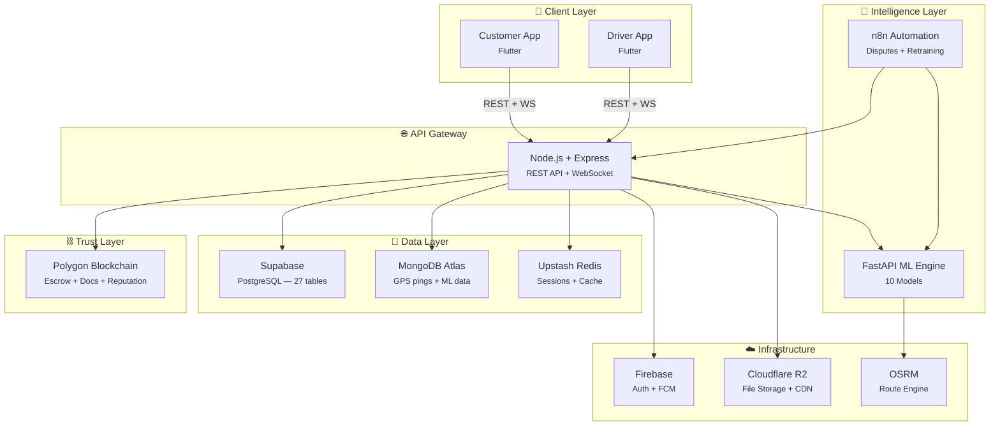
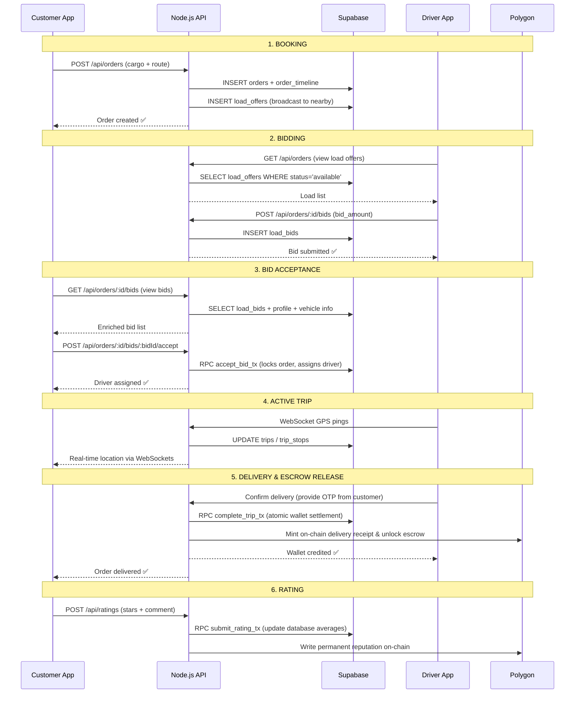
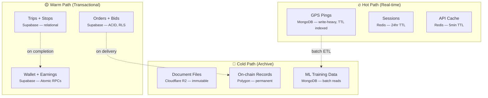

# 🏗️ System Architecture & Tech Stack

Truxify is designed as a distributed, decoupled, 6-layer architecture. It leverages microservices, smart contracts, and real-time streams to connect manufacturers and truck drivers directly and securely.

---

## 🗺️ High-Level Architecture Diagram

---

## 🎛️ Service Responsibilities

Truxify divides data storage and functionality across specialized micro-backends to maximize scalability and cost-efficiency:

| Service | Technology | Role & Responsibility |
| :--- | :--- | :--- |
| **Mobile Apps** | Flutter | Frontend for Customers (to post loads, track trips, run voice queries) and Drivers (to accept offers, get turn-by-turn navigation, upload documents). |
| **Main API Gateway** | Node.js + Express | Handles HTTP routing, WebSocket connections for live tracking, Firebase JWT authentication, transactional database triggers, and smart contract relayer integrations. |
| **ML Engine** | FastAPI + Python | Hosts 10 connected machine learning models for dynamic pricing, route sequence planning, cargo-to-truck matching, and return-load recommendations. |
| **Primary Relational DB** | Supabase (PostgreSQL + PostGIS) | Houses the core relational schema (27 tables) for user profiles, order metadata, bids, trips, financial ledger records, and ratings. Uses stored procedures (RPCs) for atomic wallet and order transactions. |
| **Event Database** | MongoDB Atlas | Stores high-frequency, non-relational telemetry data: driver GPS pings, user activity events, and historical telemetry data used for offline ML model retraining. |
| **Caching & Sessions** | Upstash Redis | Manages user session state, caches database query results (5-minute TTL), tracks rate-limit counters, and maintains driver presence records. |
| **Object Storage** | Cloudflare R2 | Stores unstructured binary assets such as driver license PDFs, vehicle registration RC scans, profile photos, and invoice receipts using time-limited pre-signed URLs. |
| **Trust Layer** | Polygon Ledger + Solidity | Custodies trustless payment escrows, records cryptographic hashes of driver verifications on-chain, issues immutable delivery receipts, and aggregates permanent driver ratings. |
| **Routing Service** | Open Source Routing Machine (OSRM) | Computes distances, durations, and multi-stop optimal routes using free OpenStreetMap data, bypassing Google Maps API charges. |

---

## 🔄 Data Flow: The Order Lifecycle

The sequence diagram below represents how an order transitions from placement to delivery, highlighting the interaction between the frontend, Node.js gateway, PostgreSQL database, and Polygon ledger:

---

## 💾 Data Partitioning Strategy

Data in Truxify is classified into three temperature paths to optimize resource usage, query speeds, and cloud costs:

* **Hot Path (In-Memory/NoSQL)**: Handles high-throughput writes (WebSocket GPS coordinate telemetry stream) and fast-read checks (user session tokens, API rate limits).
* **Warm Path (Relational RDBMS)**: Manages structured, ACID-compliant business transactions (placing orders, accepting bids, updating driver wallet balances). Row-Level Security (RLS) is strictly enforced here.
* **Cold Path (Storage/Blockchain)**: Archival documents (license scans in Cloudflare R2), immutable receipts (blockchain smart contract logs), and historical tracking points (MongoDB offline training collections).

---

## 🔒 Security Model

Security is applied at the application, transport, database, and ledger levels:

* **Authentication**: Managed via Firebase Auth. The frontend logs in via phone number (OTP) and obtains a JWT token. This token is passed in the `Authorization: Bearer <token>` header of every API request.
* **Authorization**: The Node.js `auth.js` middleware validates the Firebase token, checks the profile in Supabase, and binds `req.user` and `req.user.role` to the request object.
* **Database Isolation**: Row-Level Security (RLS) policies are active on PostgreSQL. Clients never talk to Supabase directly; they interact only with the Express API. The API uses a secure `SUPABASE_SERVICE_ROLE_KEY` to perform authorized operations under strict API validation.
* **Data Integrity**: Financial ledger transactions (allocating pending balances, withdrawing funds) are processed inside Supabase using Postgres functions with explicit `SELECT ... FOR UPDATE` row locking to prevent race conditions or double-spending.
