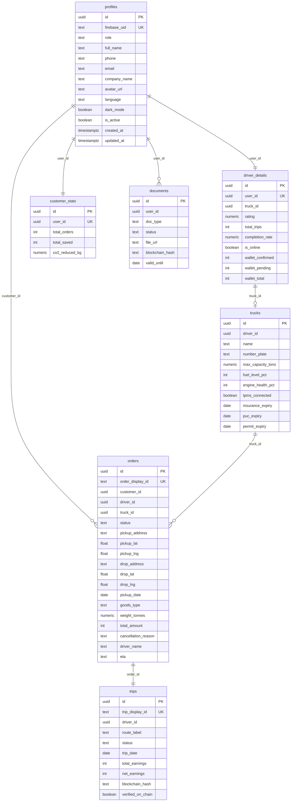

# 📊 Database Schema & SQL Transaction Flows

Truxify implements a decoupled database design across **Supabase (PostgreSQL)**, **MongoDB**, and **Redis**. Relational integrity, row authorizations, and atomic operations reside in Supabase, while event history is kept in MongoDB and in-memory caches in Redis.

---

## 🗺️ Entity Relationship Diagram (ERD)

Truxify tracks 27 distinct entities. Logical relationships (application-level joins) are utilized to link data together:



---

## 🧠 Logical Relationships (Zero Foreign Keys)

> [!IMPORTANT]
> Truxify enforces **no physical foreign keys** in the database layer. All table associations are maintained logically at the application-layer (via REST query filters or RPC joins). 
> 
> **Why?**
> 1. **Decoupled Scaling**: Allows database partitions or separate micro-backends to scale independently (e.g., migrating trips to a separate database server in the future without breaking constraints).
> 2. **Flexible Deletions & Archive**: Archiving or cleaning up old orders does not result in cascade errors or locks.
> 3. **Improved Performance**: Eliminates parent-check write locks on heavy inserts.

---

## 🗃️ Core Table Definitions

### 1. Identity & Profiles
* **`profiles`**: The central user index. Stores names, emails, phones, and settings. Linked to Firebase Auth via `firebase_uid`.
* **`driver_details`**: Extended stats for drivers, including ratings, trip counts, online toggles, and wallet ledger values.
* **`customer_stats`**: Aggregates customer booking frequencies, dynamic savings, and calculated CO₂ reductions.

### 2. Fleet & Diagnostics
* **`trucks`**: Stores truck capacities, registration plates, fuel/engine telemetry, and document expiry flags.
* **`tyre_diagnostics`**: Real-time TPMS pressure values mapped per tyre position (front-left, rear-right, etc.).
* **`truck_maintenance_tickets`**: Tracks repair requests and scheduling histories for trucks.

### 3. Orders & Marketplace
* **`orders`**: Stores pickup/drop coordinates, weight, cargo type, pricing details, status, and assigned driver.
* **`order_timeline`**: Milestones for active orders (e.g., "Assigned", "Picked Up", "In Transit", "Reached", "Delivered").
* **`load_offers`**: Marketplace listings visible to nearby drivers.
* **`load_bids`**: Bids placed by drivers on active load offers.

### 4. Trip Logs & Maps
* **`trips`**: Active driver routing records tracking earnings and verification states.
* **`trip_stops`**: Sequential drop off points mapped to multi-delivery routes.
* **`route_map_points`**: GPS breadcrumbs indicating historical routes.

---

## ⚡ SQL Transaction Flows (RPC Functions)

To prevent race conditions, double-allocations, or partial record failures during critical state changes, Truxify runs atomic SQL routines inside PostgreSQL.

### 1. Bid Acceptance (`accept_bid_tx`)
When a customer accepts a driver's bid:
```sql
-- Logical sequence:
-- 1. Verify bid is 'pending' and order is 'pending'
-- 2. Lock order and driver records using SELECT FOR UPDATE
-- 3. Update order status to 'assigned', assign driver_id and truck_id
-- 4. Update load_offers status to 'assigned'
-- 5. Mark accepted bid as 'accepted' and all other bids for that load as 'rejected'
-- 6. Insert first milestone into order_timeline
```

### 2. Trip Completion (`complete_trip_tx`)
When a driver enters the correct customer OTP and confirms delivery:
```sql
-- Logical sequence:
-- 1. Lock orders, trips, and driver_details records
-- 2. Update order status to 'delivered' and trip status to 'completed'
-- 3. Transition order_timeline milestones to 'completed'
-- 4. Credit earnings to driver's balance in driver_details:
--    - Add trip net profit to wallet_confirmed
--    - Deduct from wallet_pending (if previously escrowed)
-- 5. Create a transaction audit log in wallet_history
```

### 3. Wallet Withdrawal (`withdraw_funds_tx`)
When a driver requests a withdrawal from their in-app wallet to UPI:
```sql
-- Logical sequence:
-- 1. SELECT wallet_confirmed FROM driver_details FOR UPDATE
-- 2. Check if balance >= request_amount
-- 3. Deduct request_amount from wallet_confirmed and wallet_total
-- 4. Log transaction in wallet_history with status = 'processing'
--    (n8n or UPI broker handles execution; failures revert the balance)
```

### 4. Reputation Update (`submit_rating_tx`)
When a customer rates a driver after a trip:
```sql
-- Logical sequence:
-- 1. Insert review into ratings table
-- 2. Compute new average rating for user:
--    avg_rating = (SUM(stars) / COUNT(ratings))
-- 3. Update driver_details.rating
-- 4. Trigger on-chain event logger queue
```
